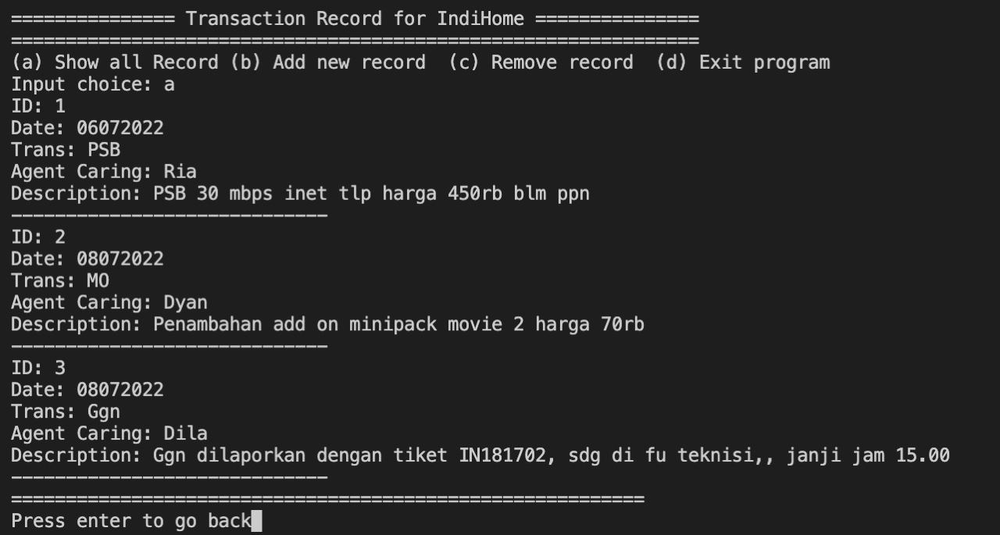

# Transaction Record for IndiHome

Final project for Blockchain stream in Telkom Athon

TROFI or Transaction Record for IndiHome is a personalized transaction for IndiHome user so they can see their transaction record in IndiHome ex: PSB, MO, Info, Ggn, CAPS. They can add or delete their transaction in the record. It's more secure and traceable because of the blockchain itself.

Next step of this project is to make the transaction linked into frontliner record, so IndiHome user can see their transaction record without add it manually in their record again. Not also that, we are trying to expand this system so it can be used as a tool for see the habit of IndiHome user that is useful for customizing the preferences of customer (customer based).

Hopefully, this Trofi can increase trust and customer experience for IndiHome.

## How to use
1. Install GHC, cabal-install and haskell-language-server via [GHCup](https://www.haskell.org/ghcup/)
2. Open terminal, and change directory to this project
3. Run `$ cabal build`
4. After it successfully built, run this project with `$ cabal run`